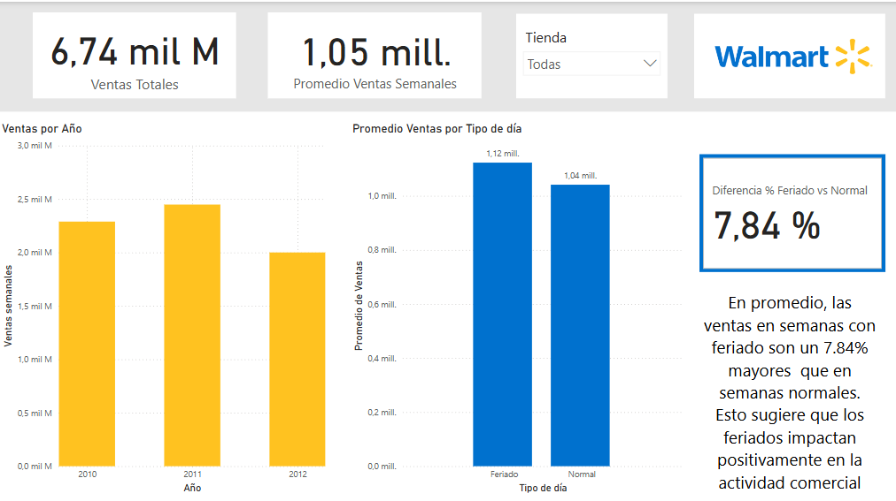

# 📊 Dashboard de Desempeño Comercial – Walmart

Este proyecto presenta un análisis de desempeño comercial utilizando datos de ventas semanales de tiendas Walmart, cruzados con variables externas como inflación (CPI), desempleo, precio del combustible y temperatura. El objetivo principal es identificar cómo estos factores influyen en las ventas, para facilitar decisiones estratégicas en entornos económicos variables.

---

## 🎯 Objetivos del análisis

- Analizar el comportamiento de ventas semanales por tienda.
- Evaluar el impacto de semanas con feriados en el desempeño comercial.
- Identificar correlaciones entre ventas y variables externas (CPI, desempleo, temperatura, precio del gasoil).
- Comparar tendencias de ventas entre distintas sucursales.

---

## 🧮 Datos utilizados

**Fuente:** archivo `Walmart_sales.csv`  
**Campos principales:**

- `Tienda`: identificador de tienda
- `Fecha`: semana de la venta
- `Ventas Semanales`: ventas totales semanales
- `Holiday_Flag`: si la semana incluye un feriado
- `Temperatura`: temperatura media semanal
- `Precio del gasoil`: precio promedio del combustible
- `CPI`: índice de precios al consumidor
- `Desempleo`: tasa de desempleo

---

## 🧠 Principales insights

- Las tiendas responden de forma distinta a las variaciones del CPI: algunas muestran relación inversa (mayor inflación, menos ventas), mientras que otras presentan el comportamiento opuesto.
- Las semanas con feriados no siempre implican un aumento en ventas: en ciertas tiendas representan una baja.
- El desempleo y la temperatura también muestran correlaciones distintas según la tienda.

---

## 🧩 Visualizaciones incluidas

- KPIs clave: ventas totales, promedio semanal, semana con mayor venta
- Gráfico de tendencia semanal (ventas vs fechas)
- Comparativo de ventas promedio: feriados vs. días normales
- Scatter plot (gráfico de dispersión): relación entre CPI y ventas por tienda
- Filtros interactivos por tienda, fecha, feriado, y valores de CPI/unemployment

---

## 🛠️ Herramientas utilizadas

- [Power BI Desktop](https://powerbi.microsoft.com/)
- DAX para medidas personalizadas
- Diseño responsivo para visualización clara y profesional

---

## 📷 Captura del dashboard

---

## 🙋‍♀️ Sobre mí

**Inés** – Consultora de negocios y analista de datos.  
Ayudo a empresas a convertir datos en decisiones inteligentes.  
Este proyecto forma parte de mi portafolio profesional para atraer clientes interesados en análisis de desempeño comercial y visualización de datos.

📩 Contacto: *inesalarconscura@gmail.com*

---
